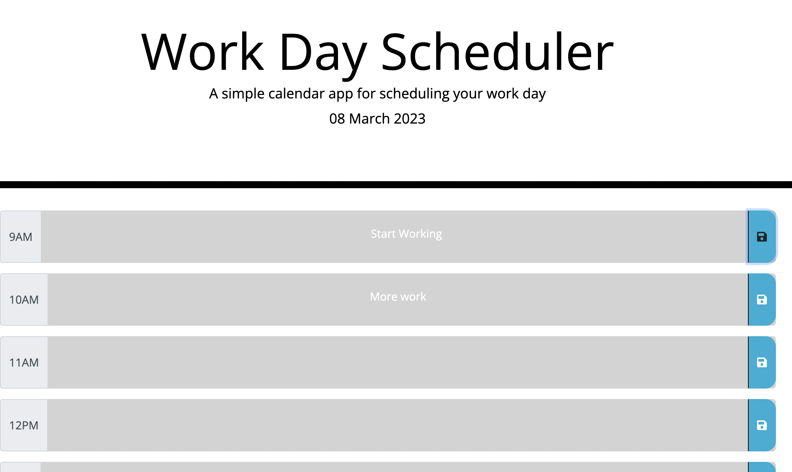

# work-day-scheduler

## Description

This application is a working day Planner/Calendar powered using the third party JS libraries Moment and jQuery. Today's date is provided and colour coded timeblocks, representing typical working hours of 9AM-5PM are presented to the user, which are colour coded based on whether the hour of the day is in the present, past or the future. User input is stored to browser local storage, upon clicking the button corresponding to the Timeblock and user input persists on refresh.

## Installation

N/A

## Usage

Load the application and enter input into any of the fields. Your input will persist on refresh and using the browser Dev Tools, navigate to local storage and you will see your input is stored there. A message is appended to the UI on button click to inform that input has been saved to local storage.

## Screenshot

## URL

The URL of the deployed application is: https://sdjhen.github.io/work-day-scheduler/

## Credits

N/A

## License

NONE
